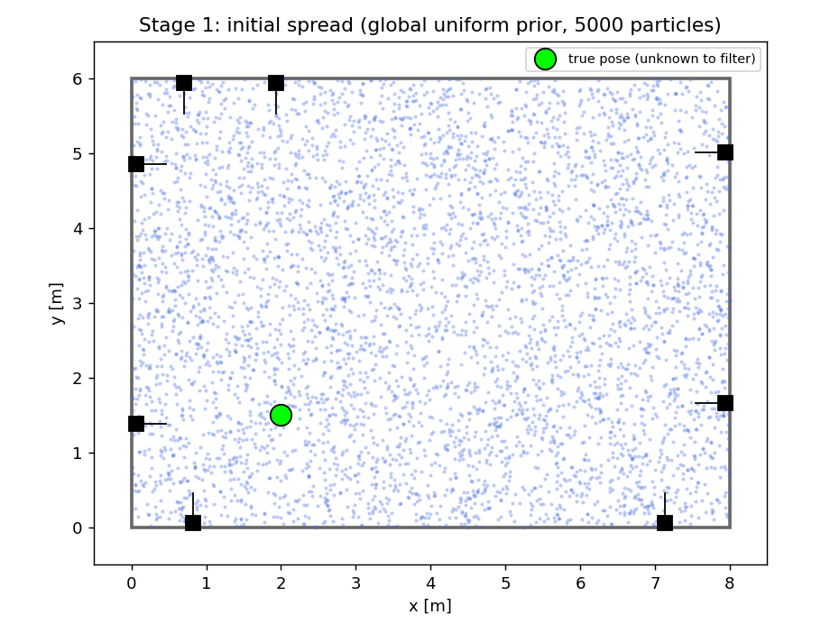
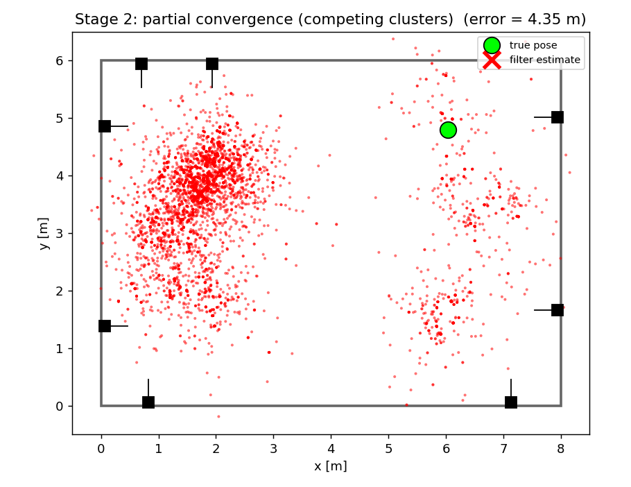
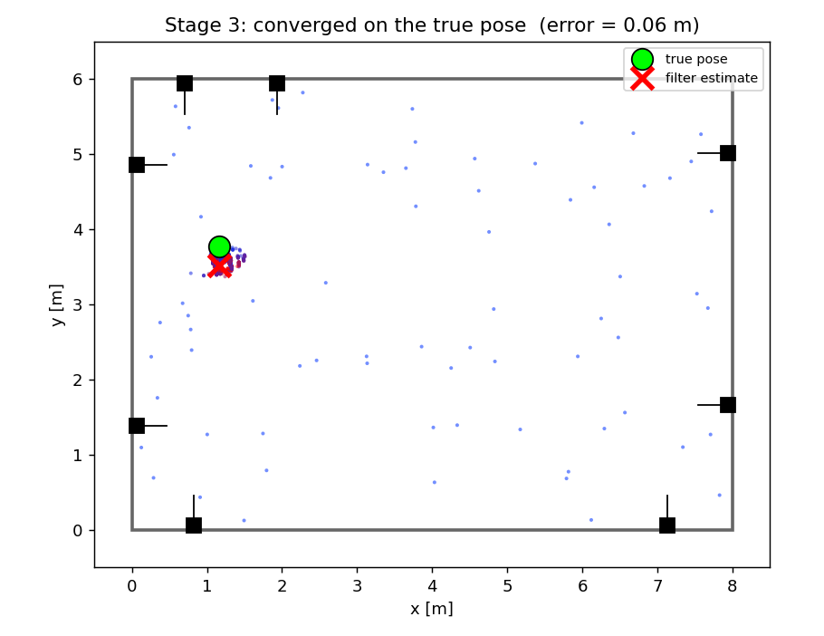
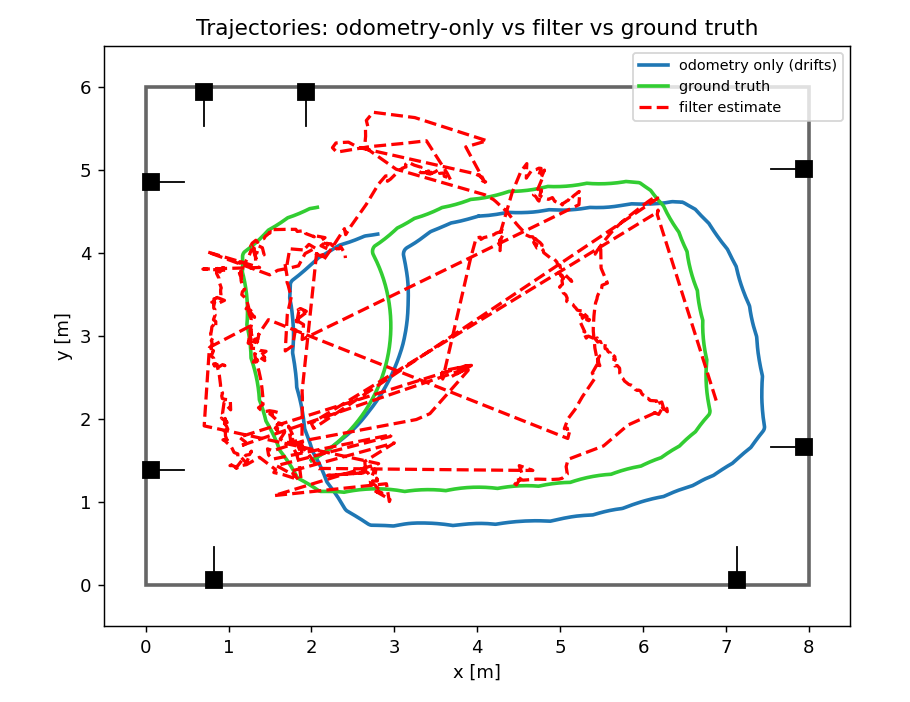

# Particle Filter Localization with AR Tags in Simulation

**Course final project — simulation component**
Author: eg · Instructor: Dr. Özgür Erkent · TA: Mehmet Muratoğlu

**Source code:** `https://github.com/<your-username>/pf_localization`  *(replace with your repo URL)*

---

## Abstract

We implement Monte-Carlo (particle filter) localization for a teleoperated
differential-drive robot in a simulated room. The room's walls carry eight
**identical** AR tags (tag36h11, all id 0), two per wall, arranged
**asymmetrically**. The robot's forward camera detects the tags, but since the
tags are indistinguishable, a detection carries *no* identity — only a relative
range and bearing. The filter handles this with a **multi-hypothesis measurement
model** in which every observation is explained as a marginal over all eight
candidate tags. Starting from a globally uniform belief, the cloud first forms
several plausible clusters (the room looks ambiguous from only a few tags) and
then collapses onto the true pose as driving reveals more of the asymmetric
layout. The build runs on ROS 2 Jazzy + Gazebo Harmonic.

---

## 1. Simulation setup

### 1.1 Room and tag layout

The room is a closed rectangle of **8.0 m × 6.0 m** with 1.5 m walls. Eight tags
(side length **0.40 m**, identical, tag36h11 id 0) sit at height 0.55 m, two per
wall. Their world positions are deliberately **asymmetric** so the global
configuration is unique — this is what lets a single pose hypothesis eventually
win:

| Tag | Wall | (x, y) [m] | Faces |
|----:|------|------------|-------|
| 0 | South (y=0) | (0.83, 0.06) | +y |
| 1 | South (y=0) | (7.13, 0.06) | +y |
| 2 | North (y=6) | (0.70, 5.94) | −y |
| 3 | North (y=6) | (1.93, 5.94) | −y |
| 4 | West (x=0)  | (0.06, 1.38) | +x |
| 5 | West (x=0)  | (0.06, 4.86) | +x |
| 6 | East (x=8)  | (7.94, 1.66) | −x |
| 7 | East (x=8)  | (7.94, 5.01) | −x |

These positions are **not** arbitrary: they were chosen by a search that
*maximizes* asymmetry. For each room symmetry (180° rotation, mirror about
x=4, mirror about y=3) we measure how far the transformed tag set lands from the
original equally-oriented tags; this layout guarantees that under every symmetry
at least one tag is **≥ 5.2 m** from any match. Consequently there is **no
self-consistent "ghost" pose** (e.g. a 180°-rotated copy), which is what allows
the filter to settle on a *single* hypothesis. (An earlier, only mildly
asymmetric layout left a near-180° ghost that the filter would occasionally lock
onto — see §6.)

These values live in `config/tag_map.yaml`, the **single source of truth**:
`generate_world.py` turns them into the Gazebo world *and* the filter loads them
as its known map, so the simulated room and the filter's map can never disagree.

### 1.2 Robot and camera

A differential-drive robot (0.40 × 0.30 × 0.15 m chassis, 0.08 m wheels, 0.36 m
track, rear ball caster) carries a forward-facing camera mounted 0.18 m forward
and 0.20 m up, looking along +x. The camera renders at 640 × 480 with a
horizontal field of view of **1.50 rad (≈ 86°)** — wide enough that the robot
usually sees **two or more** tags at once, which is the geometric key to
resolving the single-tag ambiguity. The Gazebo `DiffDrive` system
consumes `/cmd_vel` from `teleop_twist_keyboard` and publishes wheel odometry on
`/odom`; a `PosePublisher` provides ground truth (used only for visualization and
error evaluation).

### 1.3 Two detection paths

* **Camera (default).** `tag_detector_node` runs a `tag36h11` detector
  (`pupil-apriltags`) on the rendered image. Using the camera intrinsics from
  `/camera/camera_info` and the known 0.40 m tag size it recovers each tag's
  pose, converts it from the optical frame to the robot base frame, and publishes
  the relative position — **without any id**, since all detections are id 0.
* **Simulated (`detection_mode:=sim`).** `sim_detector_node` synthesizes the same
  message directly from ground truth: for each tag that is in range, inside the
  field of view, and on its visible front face, it emits a noisy range/bearing
  with a per-tag detection probability. This is deterministic and decoupled from
  the render pipeline — ideal for tuning and for a guaranteed demo.

Both publish the **identical** message contract on `/tag_detections`
(`geometry_msgs/PoseArray` of anonymous tag positions in `base_link`), so the
filter is agnostic to which detector produced the data.

---

## 2. The particle filter

The belief over the robot pose $x_t = (x, y, \theta)$ is represented by a set of
$N$ weighted particles $\{(x_t^{[m]}, w_t^{[m]})\}_{m=1}^N$ (default $N = 3000$).
Each filter cycle is **predict → update → (resample)**.

### 2.1 Prediction — odometry motion model

We use the sampling odometry motion model (Thrun, Burgard & Fox,
*Probabilistic Robotics*, Table 5.6). Consecutive odometry poses are decomposed
into a rotate–translate–rotate triple:

$$
\delta_{\text{rot1}} = \operatorname{atan2}(\bar y' - \bar y,\ \bar x' - \bar x) - \bar\theta,\quad
\delta_{\text{trans}} = \sqrt{(\bar x'-\bar x)^2 + (\bar y'-\bar y)^2},\quad
\delta_{\text{rot2}} = \bar\theta' - \bar\theta - \delta_{\text{rot1}} .
$$

Each particle is moved by a **noisy** copy of this increment:

$$
\hat\delta_{\text{rot1}} = \delta_{\text{rot1}} - \varepsilon(\alpha_1\delta_{\text{rot1}}^2 + \alpha_2\delta_{\text{trans}}^2),\quad
\hat\delta_{\text{trans}} = \delta_{\text{trans}} - \varepsilon(\alpha_3\delta_{\text{trans}}^2 + \alpha_4(\delta_{\text{rot1}}^2+\delta_{\text{rot2}}^2)),
$$
$$
\hat\delta_{\text{rot2}} = \delta_{\text{rot2}} - \varepsilon(\alpha_1\delta_{\text{rot2}}^2 + \alpha_2\delta_{\text{trans}}^2),
$$

where $\varepsilon(b^2)\sim\mathcal N(0,b^2)$, followed by
$x' = x + \hat\delta_{\text{trans}}\cos(\theta+\hat\delta_{\text{rot1}})$, etc.
The whole step is vectorized over all particles (`motion_model.py`).

**Noise parameters used** (`filter_params.yaml`):

| $\alpha_1$ | $\alpha_2$ | $\alpha_3$ | $\alpha_4$ |
|:---:|:---:|:---:|:---:|
| 0.08 | 0.02 | 0.06 | 0.02 |

These are intentionally a little larger than the true injected odometry error so
the predicted cloud keeps enough spread to stay robust.

> **Note on odometry drift.** In simulation the wheel odometry is nearly perfect,
> which would hide the filter's benefit. `odom_noise_node` adds a small systematic
> scale/heading error plus a random walk, producing realistic dead-reckoning. The
> filter consumes this `/odom_noisy`, and the same signal drives the
> "odometry-only" trajectory in the visualization.

### 2.2 Update — multi-hypothesis sensor model

This is the core of the project. Because all tags share one id, an observation
$z$ does not reveal which tag produced it. The likelihood must therefore
**marginalize over the tag identity**:

$$
p(z \mid x) \;=\; \sum_{i=1}^{8} P(\text{tag}=i)\, p(z \mid x, \text{tag}_i)
\;=\; \frac{1}{8}\sum_{i=1}^{8} p(z \mid x, \text{tag}_i).
$$

A single observation is a range/bearing pair $z=(r,\varphi)$. For a particle at
$x$ and tag $i$ at $(x_i,y_i)$ the expected measurement is

$$
\hat r_i = \sqrt{(x_i-x)^2+(y_i-y)^2},\qquad
\hat\varphi_i = \operatorname{atan2}(y_i-y,\ x_i-x) - \theta,
$$

and the per-tag likelihood is a Gaussian, **gated by visibility**:

$$
p(z\mid x,\text{tag}_i) =
\mathbb{1}[\text{tag}_i \text{ visible from } x]\;
\frac{1}{2\pi\sigma_r\sigma_\varphi}
\exp\!\Big(-\tfrac{(r-\hat r_i)^2}{2\sigma_r^2}-\tfrac{(\varphi-\hat\varphi_i)^2}{2\sigma_\varphi^2}\Big).
$$

The visibility indicator encodes the *generative* fact that the camera can only
have produced $z$ from a tag that is in range ($\le$ `max_range`), inside the
field of view ($|\hat\varphi_i|\le \tfrac12$`hfov`), and on its front face (the
robot lies within `max_view_angle` of the tag's outward normal). We then add a
uniform **clutter** floor $z_\text{clutter}$ for robustness to false positives:

$$
p(z\mid x) = \frac{1}{8}\sum_{i=1}^8 p(z\mid x,\text{tag}_i) + z_\text{clutter}.
$$

When a frame contains several detections they are treated as conditionally
independent, so their likelihoods multiply, and the particle weight is updated by

$$
w_t^{[m]} \;\propto\; w_{t-1}^{[m]} \prod_{k} p(z_k \mid x_t^{[m]}).
$$

We **never** collapse the sum to the single nearest tag — that shortcut is
forbidden by the assignment and would prevent the filter from representing
several competing pose hypotheses while the room is still ambiguous. The full
computation is vectorized as an $N\times 8$ broadcast in `sensor_model.py`.

**Measurement parameters used:** $\sigma_r = 0.20$ m, $\sigma_\varphi = 0.10$ rad,
`max_range` = 8 m, `hfov` = 1.50 rad, `max_view_angle` = 75°, $z_\text{clutter}=0.05$.

### 2.3 Resampling and the estimate

After normalization ($N = 5000$ particles) we compute the effective sample size
$\text{ESS} = 1/\sum_m (w^{[m]})^2$ and resample only when
$\text{ESS} < 0.5\,N$, using **low-variance (systematic) resampling**
(`resampling.py`).

Global localization can briefly commit to a wrong hypothesis before the robot
has driven far enough to refute it. To recover, we use **Augmented MCL** (Thrun
§8.3.3): we track a slow and a fast exponential average of the mean measurement
likelihood and inject a small fraction of globally-uniform particles with
probability $\max(0,\,1-\bar w_\text{fast}/\bar w_\text{slow})$, capped at 5 % and
gated by a **deadband** (`inject_threshold`): injection fires only when the
likelihood has *collapsed* (a genuinely stuck wrong lock or a kidnapped robot),
not on the moderate dips that occur at ambiguous viewpoints. While the filter is
well-localized the two averages agree, so **no** particles are injected and the
converged cloud stays put instead of re-scattering.

The reported pose is the **dominant-cluster** estimate: we find the densest cell
of a coarse spatial histogram (robust even just after resampling, when weights
are equal) and average the particles around it — circular mean for $\theta$. This
is meaningful even while the belief is multi-modal, unlike a global weighted mean
that would sit *between* clusters. A 2-D covariance is published for an
uncertainty ellipse.

---

## 3. Relation to Bayesian filtering

The particle filter is a sample-based realization of the recursive Bayes filter.
Writing $\operatorname{bel}(x_t) = p(x_t \mid z_{1:t}, u_{1:t})$:

| Bayes filter quantity | Particle-filter realization | Code |
|---|---|---|
| **Prior** $\operatorname{bel}(x_{t-1})$ | the weighted particle set from the previous step | persistent `self.particles`, `self.weights` |
| **Prediction** $\overline{\operatorname{bel}}(x_t)=\int p(x_t\mid u_t,x_{t-1})\,\operatorname{bel}(x_{t-1})\,dx_{t-1}$ | sample $x_t^{[m]}\sim p(x_t\mid u_t,x_{t-1}^{[m]})$ — push every particle through the noisy motion model | `OdometryMotionModel.sample` |
| **Likelihood** $p(z_t\mid x_t)$ | the multi-hypothesis sum over the 8 tags | `MultiHypothesisSensorModel.update_weights` |
| **Update (Bayes)** $\operatorname{bel}(x_t)\propto p(z_t\mid x_t)\,\overline{\operatorname{bel}}(x_t)$ | reweight: $w^{[m]}\propto w^{[m]}\,p(z_t\mid x_t^{[m]})$, then normalize | `detections_cb` |
| **Posterior** $\operatorname{bel}(x_t)$ | the reweighted (and possibly resampled) particle set | `estimate()` summarizes it |
| **Resampling** | draw the next prior $\propto$ weights so samples concentrate where the posterior mass is | `systematic_resample` |

The prediction step *spreads* the belief (it adds motion uncertainty); the update
step *sharpens* it (it multiplies in the evidence). Global initialization makes
the prior maximally uninformative, so the experiment shows the full
Bayesian story: a broad prior, multi-modal intermediate posteriors while the
evidence is still ambiguous, and a single sharp mode once the asymmetric tag
configuration has been observed.

---

## 4. Results

The figures below are rendered directly from the live filter data (`report/media/`,
reproducible via the capture script). They show the three required stages and the
trajectory comparison.

**Stage 1 — initial spread.** The belief is the global uniform prior: 5000
particles fill the room and the true pose is unknown.



**Stage 2 — partial convergence.** After observing a few tags the cloud condenses
into a **small number of competing clusters** — each is a region from which the
tags seen so far look the same. Here a large wrong cluster on the left coexists
with smaller clusters near the true pose (green). This is precisely the
multi-hypothesis behaviour the multi-tag sensor model is meant to produce.



**Stage 3 — converged.** After driving past more of the asymmetric layout, the
wrong clusters are starved of likelihood and only the true cluster survives. The
estimate (red ×) sits on the true pose; the few scattered points are the low-weight
particles kept by the adaptive injection.



**Trajectories.** Plotting the three paths in one view makes the filter's value
explicit: the **odometry-only** path (blue) drifts steadily away from **ground
truth** (green), while the **filter estimate** (red) — jumpy during the early
multi-hypothesis phase — settles onto the true trajectory.



**Quantitative summary (measured).**

| Detection mode | Converges | Steady-state error (last 20 s) | Detections / frame |
|---|---|---|---|
| Simulated (ground-truth oracle) | yes; cloud passes through competing clusters then locks | mean ≈ **0.07 m**, 100 % < 0.3 m (slow drive) | ~1.9 |
| Real camera (pupil-apriltags) | yes, in ~10 s | mean ≈ **0.25 m** | ~1.7 (86–96 % of frames see ≥1 tag) |

The camera detector was calibrated so that, statically, its **range bias is
+0.18 m (< 1σ)** and its **bearing bias 0.01°** (see §6). The filter publishes its
live error on `/pf/error`:

```bash
ros2 topic echo /pf/error          # live error of the filter estimate
```

---

## 5. Reproducing

```bash
sudo bash setup_env.sh                                   # once
source /opt/ros/jazzy/setup.bash
python3 src/pf_localization/pf_localization/generate_world.py
colcon build --symlink-install && source install/setup.bash
ros2 launch pf_localization bringup.launch.py detection_mode:=sim     # or :=camera
```

See the README for the full topic/parameter reference.

---

## 6. Design choices & limitations

* **Anonymous detections by construction.** Identical tags mean the detector
  literally cannot label detections, so the ambiguity is real, not simulated.
* **Visibility-gated likelihood.** Gating each tag hypothesis by whether the
  camera could actually have seen it makes the measurement model match the data-
  generating process and is what produces clean multi-modal intermediate beliefs.
* **Camera vs. sim detector.** The camera path is faithful but subject to render-
  dependent dropout at long range/oblique angles; the sim path removes that risk
  and is recommended for the recorded demo. Both feed the *same* filter.
* **Ghost elimination via the layout (§1.1).** Early experiments converged
  *confidently to the wrong pose*: the cloud collapsed (spread ≈ 6 cm) onto a
  180°-rotated copy of the true pose. The cause was a layout that was only mildly
  asymmetric, so the rotated copy was self-consistent and Augmented MCL — which
  keys off a likelihood drop — never fired. Re-choosing the tag positions to
  maximize the symmetry break (≥ 5.2 m) removed the ghost entirely.
* **Camera tag-size calibration.** AprilTag pose recovery scales linearly with the
  assumed tag size, so the *physical* black-square size on the wall must equal the
  `tag_size` told to the detector. Because the rendered texture needs a white
  quiet zone, the plaque is generated 1.2× larger than `tag.size`, making the
  black tag exactly 0.40 m. Before this fix the detector over-estimated range by
  ~20 % (+0.96 m) and the camera-mode filter never converged.
* **Limitation.** With only range/bearing and no tag identity, a perfectly
  symmetric layout would never disambiguate; convergence relies on the asymmetric
  placement and on the robot actually driving to observe enough of it.
